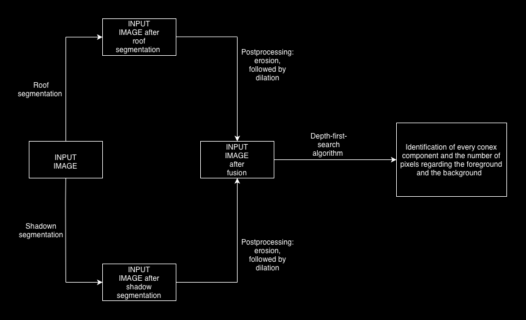
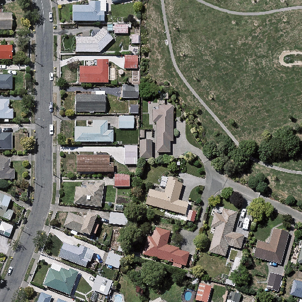
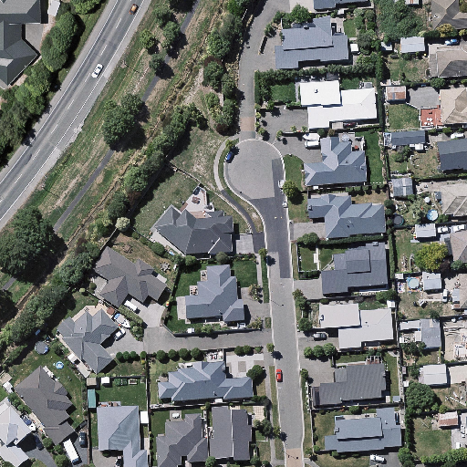
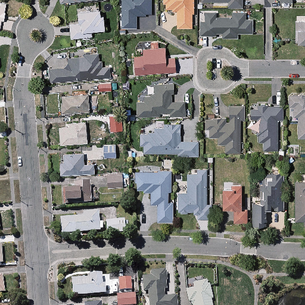
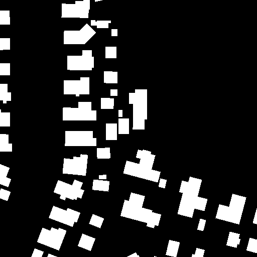
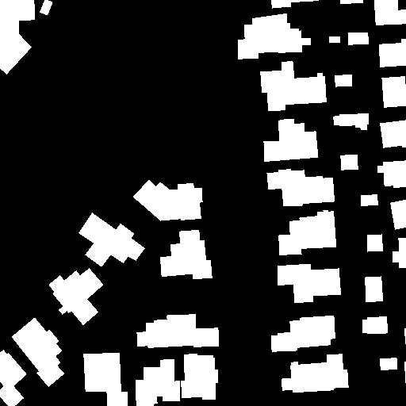
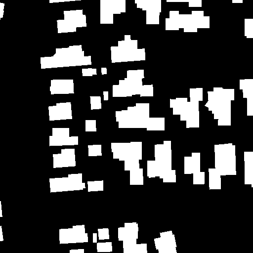

# System for Automated Photovoltaic Potential Analysis Using Deep Learning and Computer Vision

An end-to-end computer vision and deep learning system designed to automate the detection, segmentation, and ranking of building roofs for solar panel installation using high-resolution satellite imagery[cite: 1].

**Author:** Teodorescu Luca-Nicolae, 1st Year Student, Faculty of Mathematics and Computer Science 
**Coordinator:** Assoc. Prof. Dr. Alexe Bogdan 

This repository presents the core concept and methodology as showcased at the Student Scientific Communications Session organized by the University of Bucharest. The topic of this project was proposed by **PPC Romania**. Please note that this is a work in progress and the codebase may not be currently available on GitHub, as the research is actively being expanded for publication.

---

## Project Objectives

*   **Automatic Roof Segmentation:** Detecting and isolating building footprints from satellite imagery[cite: 1].
*   **Shadow Dynamics Analysis:** Mapping static and dynamic shadows cast by terrain, vegetation, or taller neighboring structures to identify actual usable roof space[cite: 1].
*   **Geometric Mask Fusion:** Overlapping the roof and shadow masks to clearly divide each roof into usable (foreground) and shaded (background) areas[cite: 1].
*   **Asset Ranking:** Creating a prioritized list of buildings based on investment cost, total usable surface area, and calculated solar irradiance[cite: 1].

---

## System Architecture

The pipeline processes input satellite images in parallel through two separate semantic segmentation streams, followed by morphological post-processing, pixel-level fusion, and connected component labeling[cite: 1]:

1.  **Parallel SegFormer Streams:** Visual features are extracted using two parallel Transformer models (one for roofs, one for shadows)[cite: 1].
2.  **Morphological Post-processing:** High-frequency noise and boundary defects are smoothed using Morphological Operations:
    $$\text{Output} = \text{Erosion}(\text{Dilation}(\text{Mask}))$$
3.  **Mask Fusion:** A pixel-level geometric logic combines both masks, separating the roof area into two zones: shaded and unshaded[cite: 1].
4.  **Connected Component Analysis:** A 2D grid **Depth-First Search (DFS)** algorithm identifies every distinct building and counts its active pixels to compute the exact physical area[cite: 1].

---

## Datasets & Training Methodology

### 1. Roof Segmentation Stream
To ensure high generalizability and prevent overfitting, the roof segmentation pipeline was trained using a robust cross-dataset strategy[cite: 1]:

*   **WHU Building Dataset (Primary):** Used to teach the model clean geometric outlines of roofs[cite: 1].
*   **Inria Aerial Image Labeling (Secondary):** High-density urban areas sliced into $512 \times 512$ pixel working tiles with a 32-pixel stride to preserve context[cite: 1].

| WHU Building Dataset | Inria Dataset |
| :---: | :---: |
| **RGB Images**     **Binary Masks**    | **Imagini RGB**     **Măști Binare**    |

---

## Experimental Evaluation & Model Selection

### Zero-Shot Testing (Pre-training Benchmark)
Before fine-tuning, raw NVIDIA SegFormer configurations (B1, B2, B3) were tested out-of-the-box on the WHU Building Dataset to evaluate their baseline representational capacity[cite: 1]:

*   **SegFormer B1 (mIoU: 0.1377):** Rejected. Too simple to process complex or adjacent building boundaries[cite: 1].
*   **SegFormer B2 (mIoU: 0.3961):** Chosen as the control model due to its high inference speed[cite: 1].
*   **SegFormer B3 (mIoU: 0.2639):** Chosen as the primary model due to its superior capacity to generalize after fine-tuning[cite: 1].

### Fine-Tuning Performance (Supervised Learning)
Models were trained on **5,732 aerial images** for **10 epochs** using Google Colab (**NVIDIA A100 GPU**)[cite: 1]:
*   **Optimizer:** AdamW (initial learning rate: $6 \times 10^{-5}$)[cite: 1].
*   **Loss Function:** Binary Cross-Entropy (BCE) Loss at pixel level[cite: 1]:
    $$\mathcal{L}_{\text{BCE}} = -\frac{1}{N}\sum_{i=1}^{N} \left[ y_i \log(\hat{y}_i) + (1 - y_i) \log(1 - \hat{y}_i) \right]$$
*   **Results:** SegFormer B2 achieved **0.84 mIoU**, while SegFormer B3 reached **0.86 mIoU** on the WHU test set[cite: 1].

### Soft-Voting Ensemble & Cross-Dataset Validation
To get the best of both worlds, we combined the model trained only on WHU (which excels at sharp borders) with the model trained on both datasets (which excels at dense urban areas) into a **Soft Voting Ensemble** (40% WHU Model / 60% Dual Model)[cite: 1]:

| Strategy | mIoU on Inria | mIoU on WHU |
| :--- | :---: | :---: |
| **Model trained on WHU** | 0.58 | 0.78 |
| **Model trained on Both** | **0.83** | 0.81 |
| **Ensemble (Soft Voting)** | 0.81 | **0.86** |

---

## Shadow Segmentation Stream

*   **Dataset:** S-EO Shadow Detection dataset (514 RGB + Shadow Mask pairs)[cite: 1].
*   **Model:** SegFormer B3[cite: 1].
*   **Feature Engineering:** The model uses **4 input channels (RGB + Segmented Roof Mask)**[cite: 1]. By injecting the roof mask directly into the shadow detection stream, the model easily learns to separate actual building shadows from asphalt or dark trees[cite: 1].

---

## Geometric Mask Fusion

The mathematical rules for combining the segmented masks to isolate the solar-ready unshaded roof areas are defined below[cite: 1]:

$$\text{Fused Pixel } C(x,y) = \begin{cases} 
      \text{Black (0)} & \text{if } R(x,y) = 0 \quad \text{(Not a roof)} \\
      \text{White (1)} & \text{if } R(x,y) = 1 \text{ and } S(x,y) = 1 \quad \text{(Usable Foreground)} \\
      \text{Red (2)} & \text{if } R(x,y) = 1 \text{ and } S(x,y) = 0 \quad \text{(Shaded Roof Area)} 
   \end{cases}$$

| Roof Mask | Shadow Mask | Fused Result (Red = Shaded) |
| :---: | :---: | :---: |
|  |  |  |

---

## Future Work & Continuous Solar Modeling

Our next development cycle will implement temporal modeling to measure exact daily energy yields[cite: 1]:

1.  **Temporal Tracking:** Process satellite image sequences of the same region taken at **30-minute intervals** throughout the day[cite: 1].
2.  **Dynamic Feature Extraction:** Monitor the unshaded pixel count $N(t)$ and light intensity $I(t)$ over time $t$[cite: 1].
3.  **Numerical Integration:** Fit a continuous function $E(t)$ using regression and calculate total daily energy yield ($E_{\text{total}}$) via integration[cite: 1]:
    $$E_{\text{total}} = \int_{t_{\text{sunrise}}}^{t_{\text{sunset}}} E(t) \, dt$$
